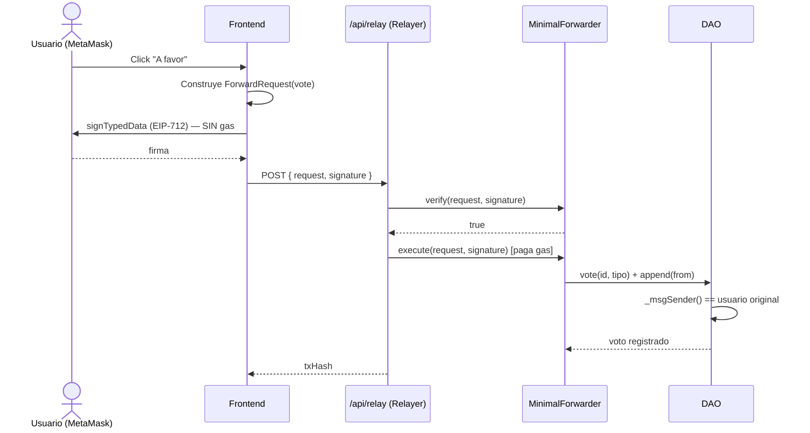
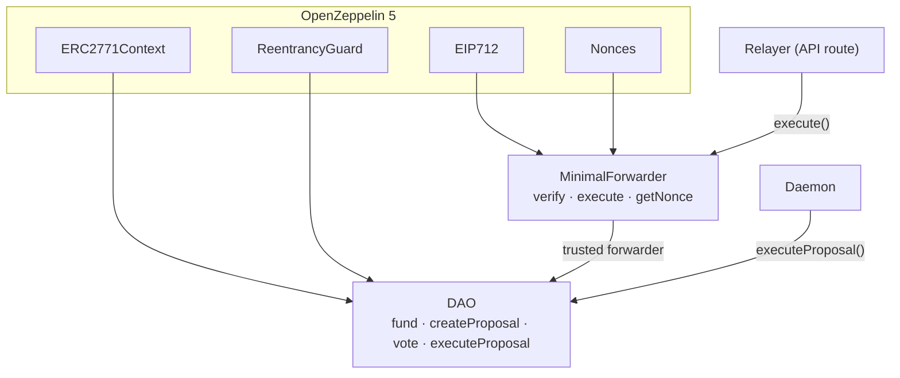
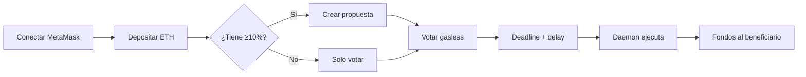

# DAO con Votación Gasless (EIP-2771)

DAO (Organización Autónoma Descentralizada) donde los miembros financian una tesorería en ETH, crean propuestas de gasto y **votan sin pagar gas** usando meta-transacciones **EIP-2771**. Las propuestas aprobadas transfieren fondos al beneficiario automáticamente tras un período de seguridad, ejecutadas por un **daemon**.

- **Contratos:** Solidity 0.8.24 · Foundry · OpenZeppelin 5 (`ERC2771Context`, `EIP712`, `ECDSA`, `Nonces`)
- **Frontend:** Next.js 15 · TypeScript · Ethers.js v6 · Tailwind · MetaMask
- **Gasless:** MinimalForwarder + Relayer (API route) + Daemon de ejecución

---

## 📁 Arquitectura del proyecto

```
3-DAO-Gasless-Voting/
├── sc/                          # Smart contracts (Foundry)
│   ├── src/
│   │   ├── MinimalForwarder.sol # Forwarder EIP-2771 (verify/execute/getNonce)
│   │   └── DAO.sol              # DAO (hereda ERC2771Context)
│   ├── test/                    # 25 tests (incl. voto gasless vía forwarder)
│   └── script/Deploy.s.sol      # Deploy local + testnet
└── web/                         # Frontend (Next.js 15)
    ├── app/
    │   ├── page.tsx             # Página principal
    │   └── api/relay/route.ts   # 🔑 Relayer: recibe firma, paga gas, envía tx
    ├── components/              # ConnectWallet, FundingPanel, CreateProposal,
    │                            #   ProposalList, ProposalCard, VoteButtons
    ├── contexts/Web3Context.tsx # MetaMask (conexión, cambios de cuenta/red)
    ├── hooks/useDaoData.ts      # Lecturas del DAO
    ├── lib/                     # config, ABIs, gasless (firma EIP-712), dao helpers
    ├── daemon/execute.mjs       # 🔑 Daemon: ejecuta propuestas aprobadas
    └── scripts/itest.mjs        # Test de integración del flujo gasless
```

---

## 🔄 Flujo de meta-transacciones (votación gasless)

El usuario **firma** un mensaje EIP-712 (gratis). El **relayer** paga el gas y lo envía al
`MinimalForwarder`, que ejecuta `vote()` en el DAO haciéndose pasar por el usuario original
(gracias a `ERC2771Context._msgSender()`).



## 🏛️ Arquitectura de contratos



## 👤 Flujo de usuario



---

## 🚀 Inicio rápido

### Requisitos
- Node.js 18+
- [Foundry](https://book.getfoundry.sh/) (`curl -L https://foundry.paradigm.xyz | bash && foundryup`)
- MetaMask (para el uso real en el navegador)

### Setup (un comando)
```bash
make setup      # instala libs de Foundry + npm, compila y corre los 25 tests
```

### Levantar todo (4 terminales)
```bash
make anvil      # 1) nodo local
make deploy     # 2) despliega MinimalForwarder + DAO (imprime direcciones)
make dev        # 3) frontend en http://localhost:3000
make daemon     # 4) ejecuta propuestas aprobadas automáticamente
```

Tras `make deploy`, copia las direcciones impresas a `web/.env.local` si difieren de las
deterministas (en un Anvil limpio ya coinciden con `.env.example`).

### Configurar MetaMask
- Red: `http://localhost:8545`, Chain ID `31337`.
- Importa cuentas de Anvil con sus claves privadas (aparecen al iniciar `anvil`).

---

## 🔐 Contratos

### MinimalForwarder (EIP-2771)
| Método | Descripción |
|---|---|
| `getNonce(from)` | Nonce actual del usuario (anti-replay) |
| `verify(req, sig)` | Valida firma EIP-712 y nonce (view) |
| `execute(req, sig)` | Ejecuta la meta-tx, añadiendo `from` al calldata |

### DAO (hereda `ERC2771Context`)
| Método | Descripción |
|---|---|
| `fundDAO()` payable | Depositar ETH (también vía `receive()`) |
| `createProposal(recipient, amount, deadline)` | Crear propuesta (requiere ≥10% del total) |
| `vote(proposalId, voteType)` | Votar A favor/En contra/Abstención (gasless; se puede cambiar antes del deadline) |
| `executeProposal(proposalId)` | Ejecuta si: deadline+delay pasó, `votesFor > votesAgainst` y hay tesorería |
| `getProposal(id)` / `getUserBalance(user)` / `treasury()` | Lecturas |

**Reglas clave:** un voto por usuario y propuesta · balance mínimo para votar · período de
seguridad (`executionDelay`) tras el deadline antes de ejecutar · `ReentrancyGuard` en la
ejecución.

---

## 🧪 Testing

```bash
make test        # 25 tests (forge)
make coverage    # DAO ~95% líneas · Forwarder ~92%
```

**Test de integración del flujo gasless** (relayer + daemon reales):
```bash
# terminal 1: anvil    terminal 2: make deploy
cd web && PORT=3010 npm run start   # servidor con /api/relay
make itest                          # firma un voto gasless → /api/relay → ejecuta
```

Escenario cubierto por los tests (del enunciado): A deposita 10, B deposita 5, A crea
propuesta (>10%), B no puede (<10%), votos gasless A favor/en contra, C deposita 20 y vota,
tras el deadline el daemon ejecuta y transfiere los fondos. Edge cases: votar en propuesta
inexistente, tras deadline, ejecutar no aprobada / ya ejecutada, cambiar voto, balance
insuficiente.

---

## 🌐 Deploy en testnet (Sepolia)

```bash
cd sc
forge script script/Deploy.s.sol --rpc-url $SEPOLIA_RPC_URL --broadcast \
  --private-key $DEPLOYER_KEY --verify --etherscan-api-key $ETHERSCAN_API_KEY
```
Ajusta `web/.env.local` con las direcciones, `NEXT_PUBLIC_CHAIN_ID=11155111`, un
`RELAYER_PRIVATE_KEY` con fondos para gas, y los RPC de la testnet.

---

## ⚠️ Seguridad

Las claves y el mnemonic aquí son las **públicas de desarrollo de Anvil**. **Nunca** las uses
en una red real. `RELAYER_PRIVATE_KEY` es un secreto de servidor: vive solo en `.env.local`
(gitignoreado) y jamás se expone al navegador (no lleva prefijo `NEXT_PUBLIC_`).
