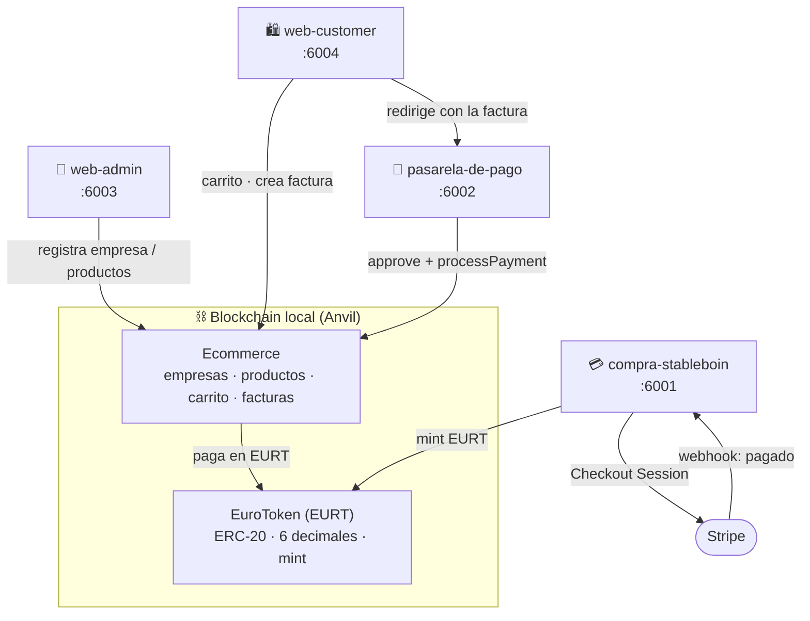
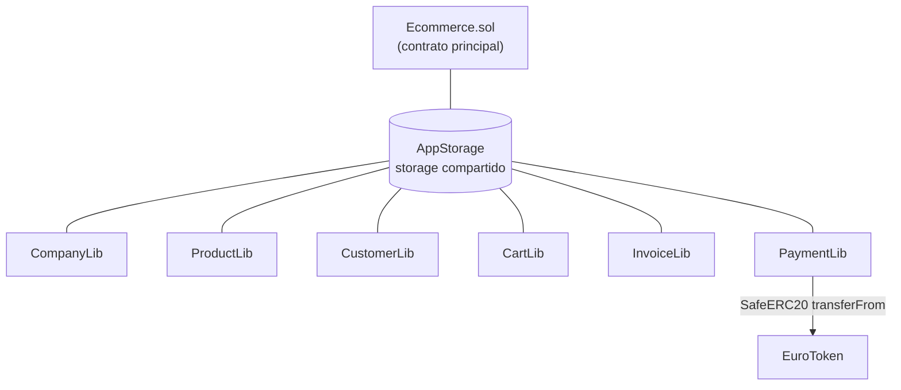
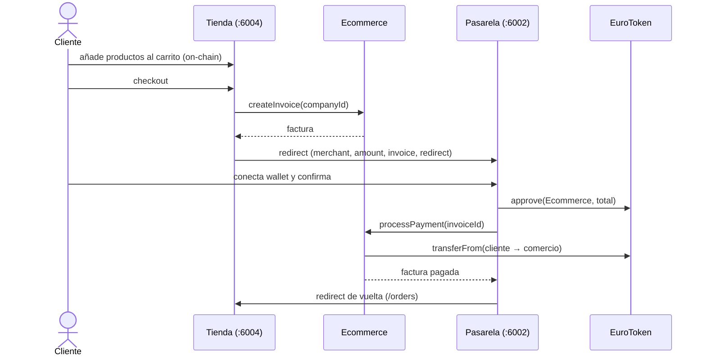

# E-Commerce on-chain con Stablecoin (EuroToken)

Sistema completo de comercio electrónico sobre Ethereum: una **stablecoin en euros (EURT)** que se compra con **tarjeta de crédito (Stripe)**, un **contrato de e-commerce** que gestiona empresas, productos, carritos y facturas, una **pasarela de pago** con tokens, y dos frontends (**admin** para comercios, **tienda** para clientes).

- **Contratos:** Solidity 0.8.24 · Foundry · OpenZeppelin 5
- **Frontend:** Next.js 15 · TypeScript · Ethers.js v6 · Tailwind · MetaMask
- **Pagos fiat:** Stripe (Checkout + webhook) → mint de EURT

---

## 🧭 Arquitectura del sistema



## 🧩 Arquitectura de contratos (patrón AppStorage + librerías)



Cada librería opera sobre la misma `AppStorage` por referencia (`storage`), sin herencia ni `delegatecall`. El contrato principal solo expone la API y aplica control de acceso.

## 🔄 Flujo completo de compra



---

## 🚀 Inicio rápido (un comando)

```bash
./restart-all.sh
```
Esto detiene procesos previos, arranca Anvil, despliega EuroToken (+1M EURT al deployer) y Ecommerce, inyecta las direcciones en los `.env.local` de las 4 apps y las levanta.

| App | Puerto | Descripción |
|---|---|---|
| Compra EURT (Stripe) | http://localhost:6001 | Comprar EURT con tarjeta |
| Pasarela de pago | http://localhost:6002 | Pagar facturas con EURT |
| Admin (comercios) | http://localhost:6003 | Empresas, productos, facturas, clientes |
| Tienda (clientes) | http://localhost:6004 | Catálogo, carrito, checkout, pedidos |

**Detener todo:**
```bash
pkill -f anvil; for p in 6001 6002 6003 6004; do pkill -f "next.*$p"; done
```

### Requisitos
- Node.js 18+ · [Foundry](https://book.getfoundry.sh/) · MetaMask
- MetaMask apuntando a `http://localhost:8545`, chainId `31337`. Importa cuentas de Anvil con sus claves privadas.

### Stripe (para la app de compra)
Pon tus claves **test** en `stablecoin/compra-stableboin/.env.local`:
```env
STRIPE_SECRET_KEY=sk_test_...
STRIPE_WEBHOOK_SECRET=whsec_...
NEXT_PUBLIC_STRIPE_PUBLIC_KEY=pk_test_...
WALLET_PRIVATE_KEY=0xac0974...   # owner del EuroToken (mint). Anvil acct #0 por defecto
```
Tarjeta de prueba: `4242 4242 4242 4242`, cualquier fecha futura y CVC. El pago acuña los EURT a tu wallet automáticamente (vía `/api/confirm`; opcionalmente reenvía webhooks con `stripe listen --forward-to localhost:6001/api/stripe/webhook`).

---

## 📁 Estructura

```
4-Ecommerce-Stablecoin/
├── stablecoin/
│   ├── sc/                    # EuroToken (ERC-20, 6 dec, mint) + tests
│   ├── compra-stableboin/     # Comprar EURT con Stripe → mint  (:6001)
│   └── pasarela-de-pago/      # Pagar facturas con EURT         (:6002)
├── sc-ecommerce/              # Ecommerce.sol + 6 librerías + tests
├── web-admin/                 # Panel de comercios              (:6003)
├── web-customer/              # Tienda para clientes            (:6004)
└── restart-all.sh            # Orquestación completa
```

## 🧪 Tests de contratos

```bash
cd stablecoin/sc   && forge test   # EuroToken: 8 tests, 100% cobertura
cd sc-ecommerce    && forge test   # Ecommerce: 21 tests, 95% líneas
cd sc-ecommerce    && forge coverage
```

## 🎬 Escenario end-to-end

1. **Comprar EURT** (`:6001`): conecta wallet → compra 1000 EURT con la tarjeta test.
2. **Registrar comercio** (`:6003`): conecta con otra cuenta → registra empresa → añade productos (Producto A €10 stock 100, Producto B €25 stock 50).
3. **Comprar** (`:6004`): añade A×2 y B×1 al carrito → checkout → crea factura (€45) → redirige a la pasarela.
4. **Pagar** (`:6002`): confirma → approve + processPayment → factura pagada.
5. **Verificar**: la tienda (`/orders`) muestra la factura **Pagada**; el admin ve el pago, el balance de EURT recibido y el stock actualizado (98/49).

---

## 🎨 Diseño

Dos identidades visuales bajo la marca **EuroChain**: el **admin** usa un tema fintech oscuro y sobrio (Fraunces + IBM Plex); la **tienda / pasarela / compra** usan una estética bold editorial (papel crema, violeta eléctrico + coral, Bricolage Grotesque, sombras duras) para transmitir energía de marketplace.

## ⚠️ Seguridad

Claves y mnemónico son los **públicos de desarrollo de Anvil**; nunca los uses en producción. El importe de pago se toma siempre de la **factura on-chain** (no de la URL). Las claves de Stripe y la clave del minter viven solo en `.env.local` (gitignored) y nunca se exponen al navegador.
