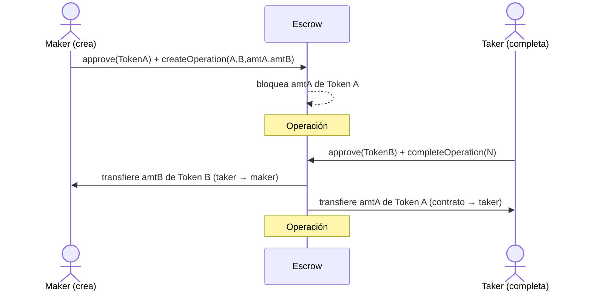
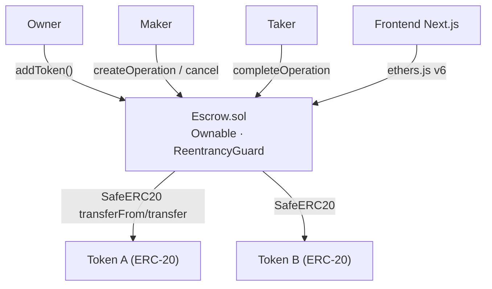

# Escrow DApp — swaps de tokens ERC-20

DApp para **intercambios seguros de tokens ERC-20** mediante un contrato de escrow: un usuario bloquea `Token A` y pide `Token B`; cualquier otro puede completar el intercambio de forma **atómica**, o el creador puede cancelar y recuperar sus tokens.

- **Contrato:** Solidity 0.8.24 · Foundry · OpenZeppelin (`Ownable`, `ReentrancyGuard`, `SafeERC20`)
- **Frontend:** Next.js 15 · TypeScript · Ethers.js v6 · Tailwind · MetaMask

---

## 🔄 Flujo del escrow


El maker puede `cancelOperation(N)` mientras esté activa para recuperar su Token A.

## 🧩 Arquitectura



---

## 🚀 Puesta en marcha

### Requisitos
- Node.js 18+ · [Foundry](https://book.getfoundry.sh/) · MetaMask

```bash
# Terminal 1 — nodo local
anvil

# Terminal 2 — desplegar (Escrow + TokenA + TokenB, whitelist, mint a 3 cuentas)
./deploy.sh                    # actualiza web/lib/addresses.ts y deployment-info.txt

# Terminal 3 — frontend
cd web && npm install && npm run dev   # http://localhost:3000
```

`deploy.sh` asume que Anvil ya corre en `http://localhost:8545`. Instala las libs de Foundry si faltan, despliega los 3 contratos, los añade a la whitelist y acuña **1000 TKA + 1000 TKB** a las 3 cuentas de test de Anvil.

### MetaMask
- Red local: `http://localhost:8545`, Chain ID `31337`.
- Importa las cuentas de test de Anvil (claves privadas que imprime al arrancar).

---

## 🖥️ Uso

- **Owner (cuenta #0):** agrega tokens permitidos (TKA/TKB ya vienen añadidos por `deploy.sh`).
- **Maker:** crea una operación (ej. ofrece 100 TKA por 50 TKB) → aprueba + confirma (2 tx).
- **Taker (otra cuenta):** ve la operación → *Complete Operation* → aprueba + confirma (2 tx).
- **Cancelar:** el maker puede cancelar una operación activa y recuperar su Token A.
- **Debug:** el panel muestra balances de ETH/tokens del contrato y las 3 cuentas, con refresh.

---

## 📁 Estructura

```
5-Escrow-DApp/
├── sc/
│   ├── src/Escrow.sol        # contrato principal
│   ├── src/TestToken.sol     # ERC-20 de prueba (TKA/TKB)
│   ├── script/Deploy.s.sol   # deploy + whitelist + mint
│   └── test/Escrow.t.sol     # 15 tests, 100% líneas
├── web/                      # Next.js: ConnectButton, AddToken, CreateOperation,
│                             #   OperationsList (auto-refresh 5s), BalanceDebug
├── deploy.sh                 # despliega y actualiza direcciones
└── deployment-info.txt       # (generado) direcciones desplegadas
```

## 🧪 Tests

```bash
cd sc && forge test        # 15/15 · happy path, reverts, edge cases
cd sc && forge coverage    # 100% líneas en Escrow.sol
```

Casos cubiertos: whitelist (solo owner, sin duplicados), crear (token no permitido, mismo token, cantidad 0), completar (no la propia, no inactiva, swap correcto), cancelar (solo creador, no dos veces), vistas vacías sin revertir.

## 🎨 Diseño

Estética de **terminal de intercambio**: fondo oscuro con rejilla, tipografía Syne + JetBrains Mono, y un **duotono** que codifica el swap — `Token A` (cian) es lo que ofreces, `Token B` (ámbar) lo que pides.

## ⚠️ Seguridad

- `ReentrancyGuard` en create/complete/cancel · `SafeERC20` en todas las transferencias.
- Un taker no puede completar su propia operación; solo el creador cancela.
- Claves y cuentas son las **públicas de desarrollo de Anvil** — nunca en producción.
