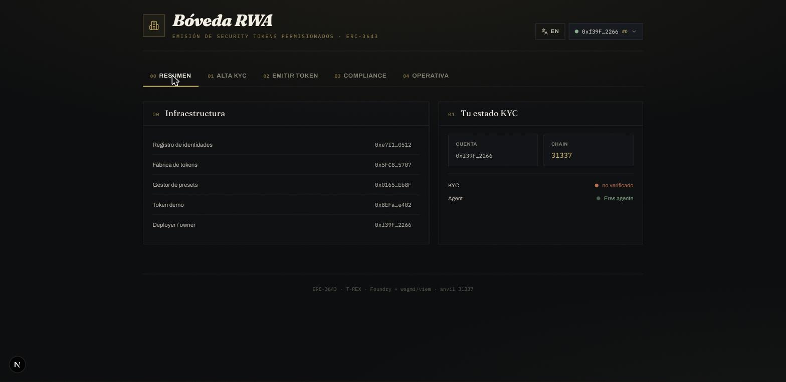
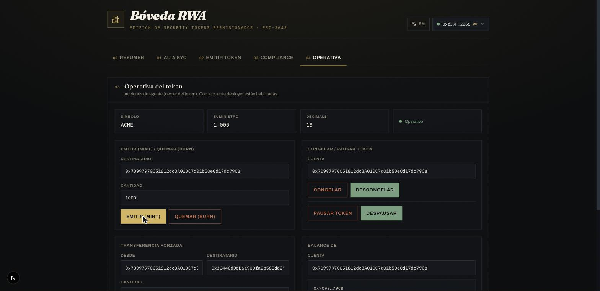

# RWA Vault — Issuer Console 🏛️

> Bilingual (EN/ES) issuer dashboard for the RWA Token Platform (ERC-3643).
> Dashboard bilingüe (EN/ES) del emisor para la plataforma RWA (ERC-3643).

Next.js + wagmi/viem front-end that drives the on-chain contracts: KYC onboarding,
token issuance with compliance presets, a live compliance panel, and agent operations
(mint / burn / freeze / pause / forced transfer).




---

## 🇬🇧 English

### Run it

```bash
# 1. From the contracts root, start a local node and deploy + write addresses:
anvil                                                     # terminal 1
forge script script/DeployWeb.s.sol --rpc-url http://127.0.0.1:8545 \
  --private-key 0xac0974bec39a17e36ba4a6b4d238ff944bacb478cbed5efcae784d7bf4f2ff80 \
  --broadcast                                             # terminal 2 → writes src/config/deployment.json

# 2. Front-end:
cd web
pnpm install
pnpm dev                                                  # http://localhost:3000
```

Click **Connect (anvil)** — no MetaMask needed. Anvil unlocks its dev accounts, so the
`mock` wagmi connector signs transactions through the node. Use the account dropdown to act
as the owner/agent (#0) or the verified investor (#1). `MetaMask` (injected) also works if
you point it at `localhost:8545`, chain `31337`.

### Sections

| Tab | What it does |
|---|---|
| **Overview** | Deployed infrastructure + your KYC / agent status |
| **KYC Onboarding** | Create identity → issue KYC claim → register (3 chained txs) |
| **Issue token** | `createTokenWithCompliance` — clone + wire modules in one tx |
| **Compliance** | Reads the selected token's aggregator and labels each active module |
| **Operations** | mint / burn · freeze / pause · forced transfer · live balance lookup |

### Stack

Next.js 15 · React 19 · wagmi v2 / viem v2 · TanStack Query · Tailwind. ABIs are generated
from `../out` (forge build); addresses from `DeployWeb.s.sol`.

---

## 🇪🇸 Español

### Cómo correrlo

```bash
# 1. Desde la raíz de contratos, levanta el nodo local y despliega + escribe direcciones:
anvil                                                     # terminal 1
forge script script/DeployWeb.s.sol --rpc-url http://127.0.0.1:8545 \
  --private-key 0xac0974bec39a17e36ba4a6b4d238ff944bacb478cbed5efcae784d7bf4f2ff80 \
  --broadcast                                             # terminal 2 → escribe src/config/deployment.json

# 2. Front-end:
cd web
pnpm install
pnpm dev                                                  # http://localhost:3000
```

Pulsa **Conectar (anvil)** — sin MetaMask. Anvil desbloquea sus cuentas dev, así que el
connector `mock` de wagmi firma las transacciones a través del nodo. Usa el desplegable de
cuenta para actuar como owner/agent (#0) o como el inversor verificado (#1). `MetaMask`
(injected) también funciona apuntándolo a `localhost:8545`, chain `31337`.

### Secciones

| Pestaña | Qué hace |
|---|---|
| **Resumen** | Infraestructura desplegada + tu estado KYC / agente |
| **Alta KYC** | Crear identidad → emitir claim KYC → registrar (3 txs encadenadas) |
| **Emitir token** | `createTokenWithCompliance` — clona + cablea módulos en una tx |
| **Compliance** | Lee el aggregator del token seleccionado y etiqueta cada módulo activo |
| **Operativa** | mint / burn · congelar / pausar · transferencia forzada · balance en vivo |

### Notas

- Las direcciones viven en `src/config/deployment.json` (las escribe `DeployWeb.s.sol`).
  Si reinicias anvil, vuelve a correr el script para regenerarlas.
- Los ABIs (`src/config/abis.ts`) se generan desde `../out`. Si cambias los contratos,
  recompila (`forge build`) y regenera los ABIs.
